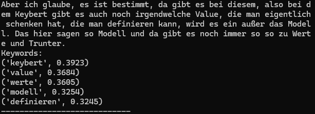

# 🎙️ Stimmenfänger – Real-Time German Speech-to-Text with BERT Attention Analysis

This project combines real-time speech-to-text transcription with keyword extraction and attention scoring. Using a lightweight speech recognition model, it transcribes spoken German audio, then leverages KeyBERT to identify and score the most relevant keywords from the transcribed text. This tool can be useful for applications like voice-driven search, meeting transcription, or content analysis.

---

## 📦 Installation

Make sure you have Python 3.8–3.10 installed.

### 1. Set up the environment

```bash
conda create -n Stimmenfaenger python=3.10
conda activate Stimmenfaenger

# Install Libary

pip install -r requirements.txt

---

## 🔍 Overview

- **Speech Recognition**: Real-time transcription using the [`RealtimeSTT`](https://github.com/Uberi/speech_recognition) interface.
- **Keyword Extraction**: Uses [KeyBERT](https://github.com/MaartenGr/KeyBERT) with the `sentence-transformers/LaBSE` model to score and extract keywords from the transcribed speech.
- **Language Support**: Configured for **German (de)** but can be adjusted.
- **Live Loop**: Continuously listens, transcribes, extracts, and prints keywords until interrupted.

---

<p align="center">

&nbsp; 

</p>


